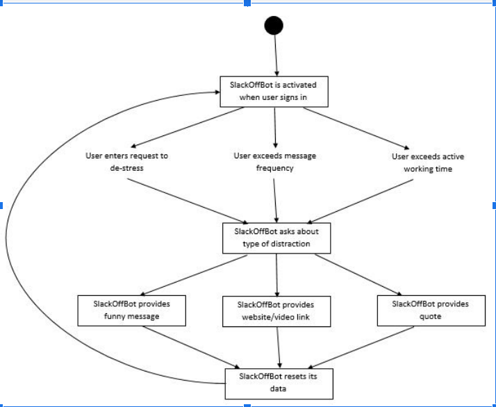

### SlackOff Bot Proposal 

## Team Members: Grace Miguel, Zack Edwards, Will Escamilla, Vivane Farnung

Problem Statement: Teams who have projects that can be worked on virtually from one’s home face the challenge of being able to “walk away” from work at the end of the day. Especially due to the COVID-19 pandemic, the use of online communication platforms like Slack, Microsoft Teams, as well others has been exhausted to replace in person interactions. A problem that teams struggle with is constant communication and work, their 9-5 job becomes a 9-9 job. Because employees are working beyond their typical workday, often times without compensation, they are more stressed and overworked which degrades their mental well being. By working longer hours with more stress, employees efficiency rates have gone down and are less productive throughout the day.   
Bot Description: 

Our SlackOffBot will destress an employee by distracting them with funny messages, website/video links, and quotes. It will attempt to destress the user on command, after a set amount of time, and if the user exceeds their personal message rate threshold (each position will have a rate that is suited for them). The Bot will also provide personal metrics regarding message rate, length of continuous active Slack time, as well as how much time the user has been active without a SlackOffBot message. 

A Bot is a better solution to this problem than a human because it is objective, it has automated metrics, and is not as overwhelming or intrusive as a co-worker or boss. 

The Bot will provide analytical metrics & respond to events such as being called by the user or automated events involving time and message frequency.

TagLine: Guilt Free Distraction, You Earned It. 

# Use Cases: 
Case 1: The User Asks for a Distraction
Preconditions: The user has been active for a while in the Slack group
Main Flow: [1]The user goes to the bot-commands chat and send a message such as -distract me, or another message the bot will recognize. [2] The bot will reply with one of several options (since ‘distract me’ is an open ended request) such as a joke, exercise, or quote. 
Subflows:
[1]The user goes to #random  and sends a message such as -distract me, or another message the bot will recognize.
[2] The bot will reply with one of several options (since ‘distract me’ is an open ended request) such as a joke, exercise, or quote. 
Alternate Flows:
-The user has sent a specific request such as “give me a joke”  a certain amount of slack messages, the Bot will reply that they should try focusing for a bit before they seek distraction

Use Case 2: The user has exceeded the message rate threshold
Preconditions: The user has been working hard for a while and has exceeded the messaging rate threshold on slack needed for a distraction. 
Main Flow: [1] The bot detects the hard work of the user by analyzing their messages per hour. [2] The bot responds by messaging the user, congratulating them for working hard and offering a short distraction. [3] The user accepts the distraction. [4] After enjoying the distraction the user will go back to work!
Subflows: 
[1] The bot detects the hard work of the user by analyzing their messages per hour.
[2] The bot responds by messaging the user, congratulating them for working hard and offering a short distraction.
[3] The user accepts the distraction.
[4] After enjoying the distraction the user will go back to work!
Alternate Flows:
[A3] The user can reject the distraction and continue to work, though they risk working too hard and burning out, making them less efficient in the long term. 
# Design Sketches 

# Storyboard: 
General Use case displaying several options including the option to distract someone else
The result of distracting someone else:

# Architecture Design

# SlackOff Bot Database

The database will have two tables, one with user metrics such as message rate, time active, and SlackOff bot request count. There other table will store responses to be sent to users such as jokes, quotes and videos. We will be using mySQL to create the database. We will use the Slack API to get the user metrics, we will use the admin.getAnalytics method as well as others to get this information in JSON format. 

Slack Server

The Slack Server handles all the user interactions and events. All user requests and timed events will pass through the Server and ping the SlackOff bot. 

# API Request

Whether the bot is initiated by a user call or a timed event, the request will be an API request to the bot. Here the bot will run its programming and retrieve the necessary information from the database. The information will then be routed over a Slack API route to the specified user. 

# API Response

After the bot receives the API request, the bot accesses the database to retrieve the information. The information is processed into the appropriate format for the user interface and is then routed to the specified user or channel. 

# Botkit

Botkit is an external starter kit that has full content management and analytics capabilities that will help aid in identifying keywords and when to respond to user messages. BotKit has a controller with a full kit of methods for different conversation and responses requests. 

# Job Queue

The job queue will store all the user requests and timed events to the bot in order of when they were requested. As each job is fulfilled it will be popped from the queue.
