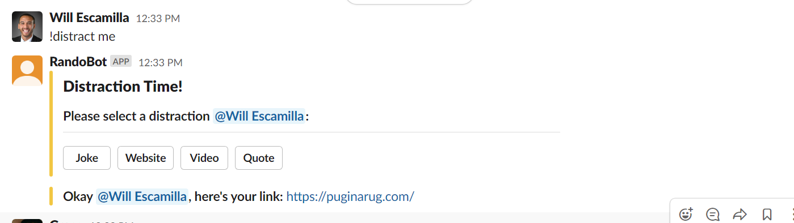
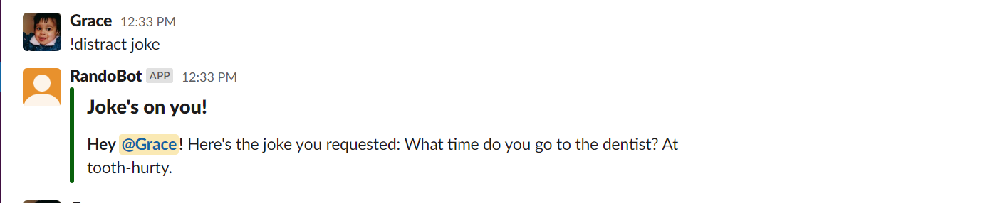
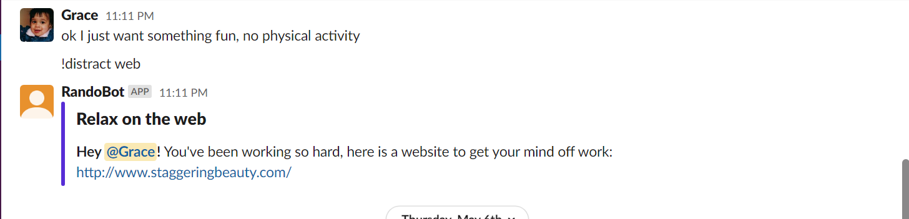
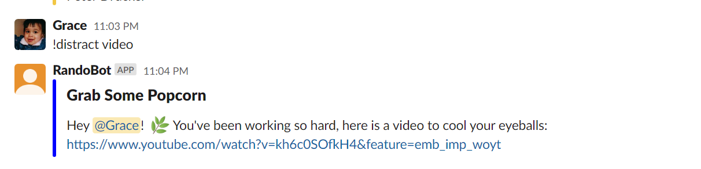
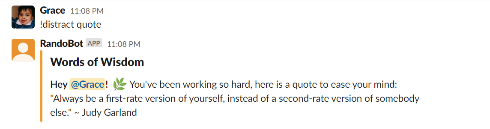
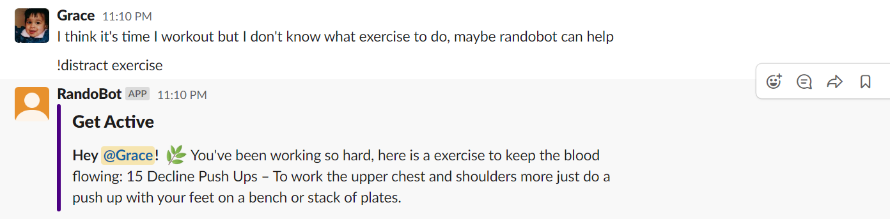
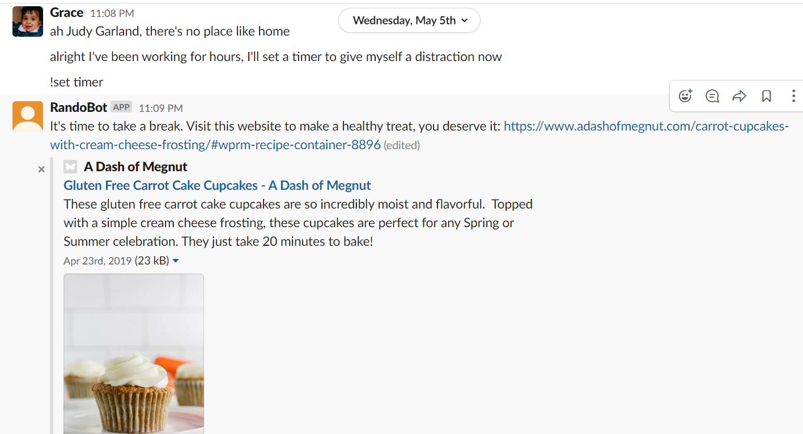
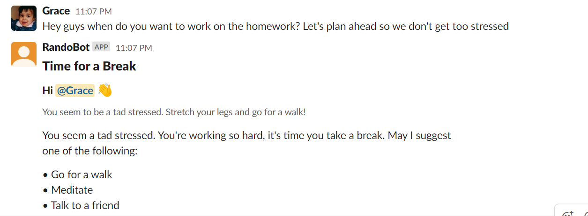

Grace Miguel 
Zack Edwards
Will Esca
Viviane Farnung

# SlackOff Bot Report

# Problem

Companies and teams who have communication tools that can be used virtually face the challenge of “stepping away” from work. With tools like Microsoft teams and Slack, it is difficult to unplug from work or take a coffee break like one normally would in the office which leads to burn out. The COVID-19 pandemic has exacerbated this issue. The SlackOff Bot helps people get distracted from work in a pleasant manner to help alleviate their stress. The bot alleviates the stress from working around the clock by gives the user distractions of their choice to take a break.

# Primary Features
* Direct calls to the SlackOff Bot- all of these calls except the timer references our Google Sheets API database. 
1. !distract me: this call will give the user distraction options. These options are: joke, video, quote, and quote. 
2. !distract joke: this call gives a user a randomized joke from our database.   
3. !distract web: this call gives a user a randomizes website from our database.  
4. !distract video: this call gives a user a randomized video from our database. 
5. !distract quote: this call gives a user a randomized quote from our database. 
6. !distract exercise: this call gives a user a randomized exercise task from our database. 
 
8. !distract timer: this call sets a timer for 30 minutes and after those 30 minutes are up, the SlackOff Bot will return a message to take a break. 

* Indirect calls to the SlackOff Bot- the bot will listen to all messages for keywords and send appropriate messages for those keywords
9. Keyword: stress, this call indicates that the user is stressed and therefore the bot will return a message telling the user to take a break. 

# Reflections

All of us use Slack as a communication tool for our clubs, jobs and/or greek organizations and felt that this project gave us a better understanding and appreciation of the functionality Slack apps have to offer. By reading through the Slack documentations, we were able to understand how some of the Slack apps we currently use operate and extrapolated that information to use for our bot. This project was extremely applicable to real life which gave it purpose. Not only did we understand how to create a bot, we also learned how to use the ngrok server, and hook a slack client id into a program. Our team used Github for configuration management which proved to be useful. The issues and projects helped us keep track of functions that were complete and incomplete. Overall, this was an enjoyable project that we all learned from. 

# Limitations & Future Work

Our team wanted to keep track of user message counts but unfortunately that functionality of Slack requires a paid account which we opted to forgo. If we were able to have this functionality we would have used that information to send a message when the user hit a certain amount of messages within a specified timeframe to tell them to take a break or give them a distraction. In the future, we may look into adding more indirect functions so the user doesn’t have to call it for a distraction. 
